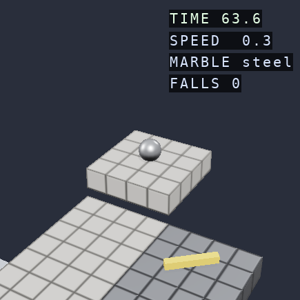
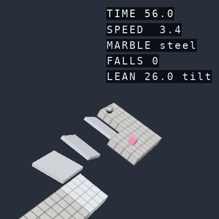

# Marble: a stand-alone game

A proposal, for review. Two pieces of work that want doing together: the game
grows the screens that make it something you can start with no arguments and
play, and the driving model changes so that a run is fast, readable, and has
more than one way through it.

Nothing here is built yet. The numbers quoted are measured from the game as it
stands today, headless, at `seed=7 difficulty=3` and `seed=1 difficulty=2`.

---

## 1. Where the pace and the control go

### The board is a one-cell corridor

`generator._carve_path` random-walks a path that never crosses itself, and every
cell of the level *is* that path. A generated board is a snake one cell wide:

```
seed 7, difficulty 3 -- 25 cells, 63.8 s limit, 5 columns x 14 rows
 .  .  .  S  .
 .  .  .  #  X       S start   F finish   # plain tile
 .  .  ^  #  #       ^ ramp    o bumper   s spring
 .  .  #  .  .       X rotating arm       | wall
 .  .  ^  .  .
 .  #  ^  .  .
 .  #  o  #  .
 .  .  .  #  #
 .  .  .  .  ^
 .  .  .  .  #
 .  .  .  s  #
 .  .  ^  #  .
 .  .  #  .  .
 .  F  #  ^  .
```

Three consequences, and they are the three complaints:

- **There is exactly one route.** Not one good route among several — one route.
- **Every obstacle is across the only lane.** A rotating arm on a one-wide path
  is a gate, not a hazard to steer around; the choice it offers is "time it or
  wait".
- **A third of the cells are transition ramps** (6 of 25 here, 9 of 20 on seed 1)
  because the walk steps height on most cells, so the run is mostly slope
  furniture rather than track.

### Forward is slow and sideways is a teleport

Measured on the physics as it is, free-rolling with no input:

| | |
|---|---|
| speed after 6 s | 2.1 m/s |
| distance in 6 s | 8.6 m = **2.1 cells** |
| effective pace | **0.35 cells/second** |

At that rate the 25-cell board above is 70 s of rolling, and the 63.8 s limit is
roughly "keep going and don't fall". Now the same measurement with the right
arrow held (`run.py` sets `keyRepeatDelay = 0.1`, so ten kicks a second):

| marble | lateral travel, 2 s held |
|---|---|
| steel | 12.5 m |
| rubber | 12.5 m |
| ice | 12.6 m |

**6 m/s sideways against 1 m/s forward, in a lane 4 m wide.** A tap is a 0.72 m/s
velocity jolt; a hold is a stutter of ten of them a second, and the amount it
moves you depends on the platform's key-repeat rate. There is no small
correction available — the smallest input the game accepts already crosses a
sixth of the lane, and a held one leaves the board.

That is the whole of "easy to see what to do, hard to accomplish". The player is
asked to thread a 4 m corridor with a control that only knows one size of nudge
and delivers it at a rate nobody chose.

The identical figures across steel, rubber and ice are the second half of it:
`linear_fraction = 0.6` of each kick is applied as direct velocity, which the
friction table never sees, and it swamps the spin component entirely. The marble
materials change how the ball looks and nothing about how it drives.

### Falling and hitting stop the game dead

- A fall freezes the camera for `respawn_delay = 2.0` s before returning control.
- A wall contact above `wall_impact_speed = 3.0` scales horizontal velocity *and*
  spin to `wall_retain = 0.1` — a glancing touch of a rail at speed leaves the
  marble at a tenth of its speed with its spin gone.

Both were reasoned as costs. On a board where reaching 2 m/s takes six seconds,
they are the majority of the run.

### You cannot see the board

`CAMERA_DISTANCE = 24.0` with a 30° field of view over 4 m cells puts about two
cells on screen. Planning a line needs seeing the line.



---

## 2. What is proposed

### 2.1 Tilt the board — the control model

The player's input becomes a **board tilt**, and gravity follows it. Held keys
(or a stick) ramp a tilt vector toward the held direction and spring it back to
neutral when released; each frame writes `world.gravity.direction` from a fixed
**base tilt toward the finish** plus the **player tilt** on top. The marble
always rolls forward on its own — the thing the original is built on — and
steering is leaning the whole board, which is the control every player already
has an intuition for.

Gravity is re-read from `world.gravity` on every step
(`omi_physics.backend.NumpyBackend.integrate_forces` → `resolve_gravity`), so
this costs one vector write per frame and no engine change at all.

The scene root gets that same tilt as a Transform, so the board visibly leans.
The lean is the feedback that tells you how hard you are pushing, and it costs
one node.

Prototyped headlessly against the real physics, base tilt 12°, from a standstill:

| input | result after 1 s |
|---|---|
| 15° right | 0.72 m lateral (0.18 cells) |
| 25° right | 1.13 m lateral (0.28 cells) |
| 35° right | 1.45 m lateral (0.36 cells) |

The pace with no input is unchanged by this, and the first draft of this document
said otherwise: the board's existing lean **already is** 12.4° (`atan(0.22)`), so
leaning it is a change to *steering*, not to speed. What the pace actually costs
is measured in §9 — it is the physics manager's damping defaults, and they are
worth more than the angle.

What this buys, in order of how much it matters:

- **Every input size is available.** A 30 ms tap leans the board a little; a hold
  leans it fully. Acceleration, not teleportation, so the response is
  proportional to how long you asked for it and small corrections exist.
- **Control stops depending on the key-repeat rate.** The tilt integrates over
  real time.
- **Authority no longer depends on grip.** Gravity acts whatever the marble is
  made of, so a player never loses the ability to steer. Friction goes back to
  being flavour — how much the ball rolls versus slides, how long it takes to
  answer — which is where the material table wants to be. In the prototype ice
  drifts 18% further than steel on the same input: felt, not disabling.
- **It scales to an analog stick** the day someone plugs one in, with no second
  control scheme.

**Tuning knobs, all data:** base tilt (pace), maximum player tilt (authority),
tilt ramp-in and spring-back rates (how sharp the board feels). Every one of them
is a number in a dataclass a test can drive.

### 2.2 Hop — one button, and most of the second solution

**Space hops.** A short upward impulse, available when grounded, on a ~0.6 s
cooldown. It is the cheapest possible source of alternative routes: on a board
that has any shape at all, a hop clears a rail, skips the outside of a corner,
crosses a gap, or reaches a terrace one step up. Every board gets an expert line
for free, and the generator does not have to author a single one of them.

It is also the answer to a blocked lane that is not "wait for the arm".

### 2.3 Braided boards, two to three cells wide

The generator changes from carving *the* path to carving a **region**:

1. Walk a spine start → finish as now.
2. **Widen** it, so the corridor is 2–3 cells across most of the way and opens
   into 4–5 cell plazas at intervals.
3. **Braid** it: add 1–3 alternate strands that leave the spine and rejoin it —
   loops, which is what makes a maze offer a choice rather than a solution.
4. Decorate *strands*, not cells: one strand of a braid gets the hazards and is
   short, the other is clear and long. That is a real decision, made at speed,
   about what you are good at.
5. Keep the connectivity and determinism tests. They get stronger, not weaker:
   with braids there is a shortest route and a safest route, and both are
   assertable.

This is what fixes obstacles-across-the-only-passage without removing obstacles.
A bumper in a 3-wide lane is something to dodge or bounce off deliberately. A
rotating arm across a plaza is a hazard with room to read it.

**Boards get shorter as they get wider** — 12–18 cells of spine — because the
interesting length is the number of decisions, not the number of tiles.

### 2.4 Pace

- **Base tilt 12–15°** instead of the current 0.22 gravity-Z component, for
  0.8–1.0 cells/second free-rolling.
- **Time limit ~1.1 s per spine cell + a small constant**, in place of today's
  2.4 s per cell. A run becomes 25–40 s: short enough that Retry is instant and
  cheap, which is what makes a fast game fast.
- **Falls cost clock, not control.** Respawn immediately at the checkpoint,
  charge 3 s on the timer, flash it on the HUD. The cost is legible and the game
  never stops.
- **Rails deflect instead of arresting.** `wall_retain` 0.1 → ~0.6, and the
  speed-kill reserved for a genuinely head-on hit — scale the penalty by how much
  of the approach was into the wall, so a graze along a rail keeps your line and
  a full-speed nose-in still costs you.
- **Camera back to ~45–55 units** and easing outward with speed, so you see the
  board and see further when you are moving. Speed-scaled distance belongs in
  `OpenGLContext.move.followcam` as an engine feature — every following camera in
  a game wants it, and glisteel's would use it too.

---

## 3. Other mechanics, with a recommendation on each

**Recommended, in the first pass**

- **Boost pads / speed strips.** Directional strips laid along a strand: choose
  the fast line and you are committed to it. Uses the ramp effect already
  written.
- **Time crystals.** Pickups worth 2–3 s, placed on the *longer* braid strand.
  This is what makes the choice between strands a real one rather than a
  preference — the safe route buys back its own cost. It gives the timer a second
  job besides threatening you.
- **A finish that is a ramp.** End the board by launching into the goal rather
  than rolling onto a pad. Costs nothing and ends a run on the high note.

**Recommended, second pass**

- **Marble as a choice with consequences.** Once friction drives feel rather than
  authority, pick the marble at the start screen and mean it: rubber grips and
  hops well, ice is fast and loose, glass is light and gets flung further by
  springs. Right now the choice is cosmetic.
- **Ghost of your best run.** A translucent marble replaying the best time on
  this board. Well-matched to a short-run, best-time game, and it makes a second
  attempt worth making. Needs a recorded position track — small, and reusable.
- **Combo/flow scoring.** Time without touching a wall or falling builds a
  multiplier shown on the HUD. Rewards the clean line without punishing the messy
  one.

**Worth discussing, not recommended yet**

- **Flippers.** Fun, and genuinely off-genre: a flipper is furniture the marble
  must be delivered *to*, which is a pinball problem, and the game we are keeping
  is a navigation problem. If they come in, they come as a *board feature* — a
  pair of paddles at a wide junction, fired with a context key when the marble is
  in the zone, that fling you up to an otherwise unreachable strand. That is a
  route, which is what we want, rather than a control scheme, which we already
  have.
- **Sticky/magnet marble.** Hold a key to grip harder (higher friction) at the
  cost of speed. Cheap to build on the pairwise-friction override and it is a
  real risk/reward dial. It may be one verb too many alongside tilt and hop.
- **Moving-platform bridges.** Elevators exist; using them as the *only* way
  across a gap on one strand makes the braid choice a timing choice. Reads well;
  wants the braid work done first.

**Against**

- **A second controllable object, or any weapon.** Out of genre and it does not
  answer any of the complaints.
- **Procedural boards as the only source.** Not a mechanic, but see §4: a game
  you can hand someone needs boards with names.

---

## 4. The stand-alone shape

Follow `glisteel` exactly, because it has already answered these questions and a
second answer would be worse and different.

```
marble/
  menu.py       main_menu / board_screen / finish_screen -- plain functions
                returning OpenGLContext.ui Panels, no GL, fully tested
  boards.py     the library: named, curated (seed, difficulty, rules) boards
                plus the player's directory
  records.py    best time per board, JSON under the player's directory
  session.py    a run, headless: board + physics + controller + clock + phase
  run.py        the window: overlays, input, camera, frames
```

- **Main menu** — Play, Boards, Settings, Quit; **Resume** first when a run is in
  progress, and Escape then closes the menu rather than throwing the run away.
- **Boards** — a `Carousel` of boards, each with its own picture and its own best
  time, exactly as glisteel shows tracks. Boards are **named curated seeds**, not
  numbers to type: `--seed 7` stays as a flag for people who want it, but
  "choose a different board" has to mean picking a thing with a name and a face.
  Board pictures come from `tools/capture.py`, which already renders a board
  headlessly.
- **Finish** — the time, where it came in this board's table, and: Retry, Another
  board, Quit.
- **Settings** — tilt sensitivity, invert, camera distance, marble. `KeyCapture`
  is in the widget set, so rebinding is available when it is wanted.
- **Escape opens the menu.** R still retries and N still skips, as accelerators.

Everything above `run.py` is headless and testable, which is the split the demo
already has and the reason its rules are tested today.

---

## 5. Where each piece lives

Per the workspace rule that features live in the engine:

**`OpenGLContext`**

- **Speed-scaled follow distance** on `move.followcam.FollowCamera`, with easing.
  Every chase camera wants it.
- **A tilt-input helper** — the held-keys-to-a-ramped-vector integrator is not
  marble-specific; it is the same object a flight demo or a boat would want. It
  takes a time step and an input state and returns a vector; no GL.
- Anything the braided generator needs that turns out to be general graph work.

**`marble`** — the board generator, the tilt-to-gravity mapping, hop, crystals,
scoring, the screens, the records.

Nothing proposed here needs a change to `omi_physics`.

---

## 6. Housekeeping this depends on

- **`marble-demo/` is not a git repository** and is untracked in the workspace.
  Per the workspace rule for new projects it wants: its own repo, ruff + mypy
  configured in `pyproject.toml`, GitHub CI running the suite, and registration as
  a submodule installed editable by `uv sync`. Worth doing before the rewrite, so
  the rewrite has history.
- **The demo had drifted from the engine.** `model`, `mathutil` and `kinematic`
  moved from `OpenGLContext.physics` to `omi_physics`; four import lines in the
  package and five in the tests now point at the new homes, and the suite is
  green at 77 passed. CI would have caught it the day it happened.
- **A rename.** If it stops being a demo and becomes a game, `marble-demo` and
  `openglcontext_marble_demo` want to be the game's name. It is still an
  advertisement for the engine either way.

---

## 7. Order of work

Each phase is playable at its end, so the feel can be judged before the next one
is built.

1. **Tilt control + camera.** Tilt integrator, gravity mapping, visible board
   lean, camera pulled back and speed-scaled. Nothing else changes. This alone is
   most of the "controls should help you" fix, and it is where the tuning
   conversation happens.
2. **Pace.** Base tilt, time budget, instant respawn with a clock charge,
   deflecting rails.
3. **Hop.**
4. **Braided boards.** Widen, braid, decorate by strand; boost strips and time
   crystals; connectivity and two-route tests.
5. **The screens.** `menu.py`, `boards.py`, `records.py`, the session split,
   board pictures, Escape.
6. **The rest**, by whatever the review of this document decides: marble
   consequences, ghost, flow scoring, flippers.

Phase 1 is the one that answers the question this document was written about, and
it is small. Worth building before agreeing the rest.

---

## 8. Open questions for the review

1. **Tilt versus keeping spin-to-steer.** The proposal replaces the kick model.
   The alternative that keeps it is to make each kick continuous — an acceleration
   while held rather than a jolt on repeat — and raise the spin share so friction
   matters. That is a smaller change and keeps the marble identity; it does not
   give the board lean, the analog path, or the same intuitiveness. Which?
2. **How wide.** 2–3 cells is a corridor you can dodge in; 4–6 is a plane with
   hazards on it, which is closer to the original and further from a maze. The
   brief says keep maze navigation, so the proposal takes the narrower reading.
3. **Curated boards, generated boards, or both.** The proposal is a named library
   of curated seeds with generation behind it. A "Random board" entry is one line
   if it is wanted alongside.
4. **Does the timer stay the failure condition?** A short run with a tight clock
   and a best-time table might want the clock to be the *score* and falling off
   to be the only failure. Time crystals push in that direction.
5. **Flippers**: in, out, or as the junction feature described in §3?

---

## 9. Phase 1, built: `spike/tilt-camera`

Phase 1 of §7 exists and is playable. Every number below is measured against the
real physics, headless; the suite is 127 tests, ruff and mypy clean.

```bash
oglc-marble                          # leaning the board, the camera back at 48 m
oglc-marble --control spin           # the model it replaces, to compare
oglc-marble --tilt 18 --lean 32      # the two angles, in degrees
oglc-marble --damping 0.3 1.5        # the physics manager's own damping, to compare
```




**C switches control model mid-run**, so the two are felt back to back rather
than argued about, and the HUD carries the board's lean and which model is
driving it.

### What it does

`tilt.TiltRig` is the whole control model, and nothing in it knows about a
marble, a window or a clock: held input in, a gravity direction and a board
rotation out. `MarbleGame` writes that direction onto `world.gravity` each frame
— the physics re-reads it every step, so no engine change was needed for the
control — and points one `Transform` at the board rotation, centred on the
marble, so the world leans **around the ball** and the ball holds its place on
screen. The camera needs to know nothing about any of it, because the point it
follows is the one point the rotation does not move.

Both models run on one gravity path: `SPIN` is the same rig with the player's
lean bounded at zero. That is the whole difference, which is why the switch is
instant and why neither model can drift away from the other.

Input is **sampled, not evented**: the engine's `InputState` already accumulates
every key transition, so a frame asks what is held. Holding two directions leans
the board diagonally, and losing the window drops the lean rather than leaving
it stuck on — both for free, and no held-key bookkeeping was written.

### Steering: what changed

Lateral travel holding *right* on a flat board, steel marble:

| held | as it was | the spike |
|---|---|---|
| 0.10 s | 0.07 m | 0.01 m |
| 0.25 s | 0.33 m | 0.06 m |
| 0.50 s | 1.10 m | 0.27 m |
| 1.00 s | 3.73 m | 1.10 m |
| 2.00 s | **11.93 m** | 3.87 m |

The old smallest input was a **0.72 m/s velocity jolt**, arriving ten a second
while a key was held; there was nothing smaller and nothing in between. The new
smallest is one frame of lean — 2.7° at 60 Hz, worth 0.46 m/s² of pull — and
every size above it exists. Two seconds of full lean now moves one lane rather
than three.

**The marble materials mean something now.** Two seconds of held right:

| | as it was | the spike |
|---|---|---|
| steel | 11.93 m | 3.87 m |
| rubber | 11.96 m | 3.93 m |
| ice | 12.17 m | 5.17 m |

Under the old model the three are within 2% of each other, because the linear
part of each kick bypassed the friction table and swamped the spin. Under the
lean, ice carries a third further than steel — a difference the player feels,
without any marble losing the ability to steer, since gravity acts whatever the
ball is made of.

### Three things the measurements turned up

**The pace was never the board's lean; it was the damping.** The scenegraph
physics manager defaults to 0.3 linear and 1.5 angular damping — right for
settling a scene of boxes, and a continuous brake on a ball whose whole job is to
roll, since rolling couples spin to travel. Free-rolling pace against those two
numbers alone:

| linear, angular | free-rolling | top speed |
|---|---|---|
| 0.3, 1.5 (the manager's) | 0.43 cells/s | 2.3 m/s |
| 0.05, 0.2 (the game's now) | 0.94 cells/s | 6.8 m/s |
| 0.0, 0.0 | 1.12 cells/s | 9.0 m/s |

The game names its own (`ROLL_DAMPING`), keeping enough that a marble at rest
settles. Board for board, that is most of the pace §2.4 asks for:

| board | as it was | the spike |
|---|---|---|
| seed 7 d3 | 0.34 cells/s | 0.57 |
| seed 1 d2 | 0.71 | 0.99 |
| seed 5 d2 | 0.71 | 1.02 |
| seed 3 d1 | 0.05 | 0.09 |
| seed 11 d2 | 0.05 | 0.09 |

**Two of those boards go nowhere, and it is not the controls.** The board's
constant lean points +Z, and the generated path leaves the start *sideways* on
seed 3 and seed 11 — so a player who touches nothing is pushed straight over the
edge and falls twice in ten seconds. The lean and the path disagree. Either the
base lean follows the carved route rather than a fixed axis, or the boards get
wide enough that the disagreement does not reach an edge; §2.3 wants the second
anyway, and the first is a few lines. This is the clearest single argument in the
document for doing the generator work.

**Raising the lean limit buys much less than it looks like it should.** Seconds
of full lean to cross one 4 m lane from rest: 2.38 s at 20°, 2.05 s at 26°,
1.67 s at 40°, 1.45 s at 50°. A rolling sphere accelerates at `(5/7)·g·sin θ`,
and `sin` flattens out; the honest lever on how sharply the game turns is the
damping above, not the angle. 26° is where the spike sits.

### Also landed

`FollowCamera` grew `pull_back` / `pull_back_speed` / `pull_back_rate` and an
`advance(dt, speed)` in the **engine** (`spike/followcam-pullback` on
OpenGLContext) — a chase camera that eases back as its target speeds up, seeing
further exactly when there is least time to react. The easing is exponential in
elapsed time rather than in frames, so the same run frames the same way on a fast
machine and a slow one. `pull_back` defaults to zero, which is the fixed-offset
camera unchanged, so no existing caller is affected. The demo sits at 48 m with
0.30 of pull-back, against the 24 m that showed two cells.

### What is deliberately not in it

- **`TiltRig` is in the demo, not the engine.** The generic part is real — held
  input to a smoothed, clamped, frame-rate-independent axis pair — but its final
  shape depends on questions the spike is meant to answer: whether it needs a
  third axis, a deadzone for an analog stick, per-axis rates. Deciding its home
  after the shape settles is cheaper than guessing now; the move is small.
- **No hop, no braiding, no screens.** Phases 3–5.
- **The impact rules and the respawn freeze are untouched** (§2.4). They are
  pace, and they belong with the rest of the pace work, where they can be judged
  against a board that is worth crossing quickly.

### One bug worth recording

The first draft of `board_rotation` built the axis as `up × gradient`, which
draws the board tipping **up** into the direction the marble accelerates — the
world leaning the wrong way. The test that should have caught it asserted the
axis was parallel to the forward axis *up to a sign*, which is exactly the thing
that was wrong. Replacing it with an assertion about what the rotation *does* —
push the board's up-vector through the engine's own `transformMatrix` and check
which way it tips — catches it, and cannot be satisfied by the wrong convention.

---

## 10. Phase 4, built: braided boards

Section 2.3 exists. `boards.py` builds a **region** in four steps that each
answer one question — where the route goes, how much room there is, how many
ways round there are, and how far the marble has come — and hands back the
**strands** that decoration hangs on, because "the short way is the dangerous
one" is a statement about strands and cannot be said about loose cells.

`generator.py` decorates by strand: hazards go on the strands that *save cells*,
the long way round stays clear, and every hazard is checked against the board as
it is placed — one that would leave no clean route from start to finish is not
placed at all.

### What holds now, over twenty-four seeds each

| | |
|---|---|
| no board is a one-cell corridor | every cell has two ways off it |
| two routes share nothing but their ends | vertex-disjoint, every board |
| a braid is a different way round | not the next lane: 13 of 13 scenic strands cost ≥ 3 cells |
| a hazard-free route always exists | at difficulty 1, 3 and 5 |
| the quick line is the one that asks something | the clean route is never shorter |
| every route cell has board downhill of it | 0 exceptions in 72 boards |

That last row is the defect §9 turned up, closed. The old generator's constant
+Z lean pushed a player who touched nothing straight over the edge on two of
five sampled boards; there is now not one route cell on any board with nothing
in front of it.

### Two things that had to change to get there

**Room is a radius, not a width.** Widening only sideways leaves the places the
route goes *sideways* one cell tall — a corridor turned ninety degrees, with a
cell in it every route has to pass through. Three of the first six boards had
exactly that pinch. A radius has no direction to get wrong.

**Height is a function of rank alone.** It gives the terraced look, makes
downhill and forward the same direction, and holds the slope budget by
construction rather than by a check afterwards: neighbours are one rank apart at
most, so they are one terrace apart at most.

### Difficulty reversed

It shortens the route and thins the plazas rather than adding tiles — a long easy
board is only a long one. Hazards go from 0.9 a board to 2.1, and the clock lands
between 15 and 45 seconds, which is short enough that another go is cheap. The
old test asserting that a harder board had *more* cells is now a test asserting
the opposite, which is a deliberate change of contract rather than a loosened
assertion.

---

## 11. The editor

`marble-editor` is a sibling project — a game does not link an editor, exactly as
glisteel and glisteel-editor are separate.

```bash
oglc-marble-editor                    # a blank board to draw on
oglc-marble-editor spiral.marble      # carry on with one
oglc-marble-editor --from-seed 7      # start from a generated board
oglc-marble --board spiral.marble     # play one
```


Six tools — tiles, height, surface, pieces, markers, pan — and two conventions
that run through all of them: **left does and right undoes**, and **a drag is one
step**. Ramps, launch ramps, rails, bumpers, springs, elevators and rotating arms
all place with a click, because the board works out which way a ramp points and
which side a rail faces.

### Where the parts are

`board.py` is the only thing that changes a level, so every rule about what a
board may be is a question a test can ask, and the tools are left holding nothing
but gestures. Undo is a **snapshot**: a board is small enough that keeping the
whole of one costs less than the bookkeeping for inverting each kind of change,
and a snapshot cannot get an inverse wrong.

Nothing stops a designer making a board that is half-drawn — that is a normal
thing to be looking at, and an editor that refused would be fighting them for the
whole middle of the work. The read-out says what would stop it being *played*
instead, most usefully that the finish cannot be reached from the start.

### What it is built on, and what it is not

The authoring toolkit in **OpenGLContext itself**: `edit` for the plan view and
the tool modes that give the tool in force first refusal of the pointer, `ui` for
the palette, the menus and the read-outs. The same foundation glisteel-editor
uses.

**`OpenGLContext-editor` is deliberately not a dependency.** That package is the
world-authoring half — DEM terrain, road alignment, 3D Tiles baking — and a board
is a grid of tiles. Depending on it would buy nothing and cost every editor user
a terrain toolchain.

The **board format belongs to the game** (`levelfile.py`), which is what keeps
the editor and the game from ever disagreeing about it. A mechanism writes itself
out of its own dataclass fields, and a test holds the registry to every authorable
class in `level.py`, so a mechanism added without a name there fails rather than
silently not saving.

### One thing the pointer bridge duplicates

`marble_editor/controls.py` turns pointer events into a
`~OpenGLContext.edit.tools.Pointer` and routes them, and glisteel-editor's
`MapControls` does the same job. The engine has the tool modes and the map view
but not the bridge between them. It is a candidate for `OpenGLContext.edit`, once
the second implementation has shown which parts of it are actually general — the
marble one wants no height function and no grab reach, and the glisteel one wants
both.

### A defect this turned up

A board carrying an **elevator or a rotating arm** logs one
`Failure in Box render: MissingVertexInput: the shader reads aColor, aJoints,
aTangent, aTexCoord1, aWeights` per run, and that one node does not draw. It
reproduces on generated boards (`--seed 0 --difficulty 4`) as readily as on
authored ones, so it predates this work. Giving the kinematic body a PBR
appearance like every other body in the game — which it should have had anyway,
and now has — did not cure it. The pass catches it, so the rest of the frame
renders. Worth chasing: it is the engine's instanced/kinematic draw path meeting
a plain `Box`, and nothing in the game can work around it.

---

## 12. What the game is missing, and what to build

Watching a recorded run says two things the tests could not.

### 12.1 The board does not feel like an object

It reads as a pinball flipper rather than a table: a huge surface thrown about
with no weight in it, and the world heaving around a ball that stays put.
Measured over one autopilot run (seed 1, difficulty 2, 771 frames):

| | |
|---|---|
| drawn lean, mean | **16°** |
| drawn lean, 90th percentile | **26°** |
| drawn lean, peak | **35°** |
| frames past 25° | **30%** |
| frames where the pilot's demand is at the stop | **34%** |
| how far a far corner of a 36 m board swings at peak | **20 m** |

Four separate causes, and they compound:

1. **The limit is per axis, so a diagonal exceeds it.** `pitch` and `roll` are
   each bounded at 26°, and the board is drawn at `atan(|gradient|)` — the two
   combined. A full diagonal draws **35°**, not 26°. The limit does not limit.
2. **The drawn lean is the whole lean.** `visual_gain` is 1.0, so every degree
   the physics uses is a degree the world turns through.
3. **There is no mass.** The lean moves at 160°/s: full deflection in 0.16 s.
   A table with a marble on it does not do that, and neither do hands.
4. **The pilot lives at the stop.** Its demand saturates on a third of frames,
   so what a viewer sees is mostly the extreme.

**What it should feel like.** A heavy table, tilted by hand: it takes an
appreciable fraction of a second to reach a lean, it eases in and out rather
than snapping, and the useful range is a handful of degrees rather than a
quarter turn. The *physics* lean and the *drawn* lean are already separate
knobs; the drawn one should be a hint of the real one, because a small visible
tilt over a large surface already reads as a large tilt.

**Requirements**

- The combined lean is bounded, not each axis separately.
- The board accelerates into a lean and eases out of it, rather than moving at a
  constant rate — second order, so there is something to feel.
- The drawn lean is a fraction of the physical one, and the fraction is a
  tunable with a default that keeps a far corner's swing under a cell or two.
- The pilot asks for a lean proportional to what it needs, and reaches the stop
  when it is in trouble rather than as a matter of course.
- The ball stays in frame: whatever the board does, the camera holds the marble.

### 12.2 There is one level, and it is a floor

Every board is the same board: a wide, gently terraced plane with a few things
scattered on it. There is nowhere you *must* reach, nothing to overcome, and no
reason to be anywhere in particular. Rolling across it is rolling across a
slightly bumpy floor.

What is wanted instead is **a series of stories**: a board that is a chain of
places, each with a thing to do, joined by transitions that are themselves the
challenge. Something like —

> On the first plateau you avoid the bumpers, because they give you too much
> energy and you will miss the turn-off; so you sneak round by bouncing off one
> wall, which lines you up for the ramp. On the ramp you have to backspin hard to
> get round the corner, which drops you into the bowl with enough speed to come
> out the far side and hit the lever that opens the door to the final room. Miss
> the turn-off and you are dropped onto the middle ramp — the forest of banking
> mushrooms — where you must hit a bumper hard enough to get through the passage
> of pinball bunkers that fling you about, and then over a narrow bridge to the
> ramp down.

Every noun in that is a piece, and every verb is a transition.

**Requirements**

**Pieces with ports.** A board is built from named pieces, each of which knows
where it is entered and where it is left — a cell, a facing and a height. A
piece places its own cells, walls and mechanisms relative to its entry, and
answers with its exit. Chaining them is what makes a board.

**Transitions are functions, and they are the challenge.** A joiner is a piece
whose whole purpose is getting from one plateau to the next, and what makes it
worth playing is the *rule* it imposes:

- **The kicker.** A dip whose far side climbs higher than its near side dropped,
  so what gets you out of it is the speed you brought in.
- **The spillway.** A ramp with no wall at the bottom end: control the descent
  or overshoot into the void.
- **The hairpin.** A right-angle turn onto a short way round. Take it at speed
  and you miss it and are committed to the long way, which is passable and slow.
- **The narrow bridge.** A one-cell span with nothing either side.
- **The scatter.** A field of bumpers that flings you about: getting through is
  partly luck and entirely about arriving with the right speed.

**Waypoints.** A board has places you must reach before the finish will take
you, so a route is a route rather than a direction. A gate is a trigger like the
finish, and the finish refuses until every gate has been passed.

**Themes per area.** A piece names a theme, and a theme says what its floors and
walls are made of — which is a look *and* a feel, since the material is the grip
— and, later, what they sound like. A board that changes underfoot as you move
through it is a board you can navigate by.

**Stories compose pieces.** A story is a list of piece-builders, so the same
kicker used in three stories is the same function, and a new challenge is a new
function rather than a new generator. Written as functions, not generated by a
model: a model in the build path is a dependency, a cost and a source of boards
nobody can reproduce, and the vocabulary here is small enough to write down.

### 12.3 Where the experiments are

One branch each, so each can be judged on its own:

| Branch | What it tries |
|---|---|
| `spike/tilt-feel` | §12.1 — the board as something with mass |
| `spike/sections` | pieces with ports, and the joiners that are the challenges |
| `spike/waypoints` | gates the finish waits for |
| `spike/theming` | per-area materials, and where sound would hook in |
| `spike/stories` | chains of pieces, and the stories built from them |

---

## 13. `spike/tilt-feel`, built

All four causes in §12.1, on the same run (seed 1, difficulty 2):

| | was | now |
|---|---|---|
| drawn lean, mean | 16.3° | **3.6°** |
| drawn lean, peak | 34.6° | **7.7°** |
| frames past 20° | 38% | **0%** |
| pilot at the stop | 34% | **7%** |
| far-corner swing at peak | 5.0 cells | **1.2 cells** |

The run still finishes, with no falls.

**The limit bounds the pair.** `pitch` and `roll` were each held under the limit,
so a full diagonal reached it times root two — 26° each drawing as 35°. They are
scaled together now, which takes away the excess and keeps the direction asked
for.

**A demand scales the pull, not the angle.** Half a stick is half the sideways
gravity, which is the quantity the marble answers to. Scaling the angle made a
half-and-full diagonal fall in a direction that was neither.

**The lean is a critically damped spring.** It accelerates into a lean and eases
out of one — about half a second to full deflection at `STIFFNESS = 8`, against
0.16 s for the rate limiter it replaces. Critically damped for two reasons: a
board that rang after being let go is a board nobody could aim, and such a system
never overshoots, so the limit holds without being clamped to. Semi-implicit, so
a slow frame settles rather than diverging.

**The drawn lean is a third of the physical one** (`VISUAL_GAIN = 0.32`). A small
tilt over a large surface already reads as a large tilt; the whole of it heaved
the world 5 cells past a ball that never moves.

**The pilot no longer lives at the stop.** Its demand was clipped per axis, which
turned two-forward-one-right into one-and-one — a direction chosen by the clip
rather than by the pilot — and it sat at full lean for over half a run. Scaling
the pair took that to 15%, and softening the steering gain from 1.5 to 0.75 took
it to 3% while finishing the same boards with fewer falls.

Every one of those is a number in a dataclass with a test on it, so the feel can
be argued about by changing them.

---

## 14. `spike/sections`, built

`pieces.py`: a board is a chain of **pieces**, each of which knows where it is
entered and where it is left — a cell, a facing, a height and a width — and
places its own cells, walls and mechanisms relative to the first. Because a piece
is a function of its entry, the same kicker is the third thing on one board and
the first on another.

Seven pieces: `plateau` (a place, walled, asks nothing), `ramp_down` (the plain
connector), and five joiners that each impose a rule — `kicker`, `spillway`,
`hairpin`, `bridge`, `scatter`. Each carries the one line it asks of a player,
and a theme.


**Themes work.** A piece names one, and a theme says what its floors and walls
are made of — a look and a feel, since the material is the grip. Four so far:
stone, ice, foundry, rubber. `Theme.sound` names the set a floor would be heard
through; nothing plays it yet.

### Two defects this turned up, both fixed

**Rolling was being treated as landing.** The hard-landing speed-kill fired on
any floor contact above the threshold, and a marble running down into a dip
pushes the floor exactly as hard as one that fell there — so it was scrubbed to a
fifth of its speed and no dip could ever be carried through, which is the whole
of what a kicker asks. The rule now keys on **how far the marble fell**, which is
what it always said in words. Getting that measured took two goes: a marble
crossing a terrace at speed hops off every lip, so being off the ground is not
enough; and one falling fast crosses the grounded tolerance a frame or two before
it touches, so the height has to be remembered for a moment after it is back
down. A marble now carries 70% of 18 m/s the whole way through a dip, and one
dropped from eight metres still loses everything.

**A stepped slope is a staircase.** Cells at stepped heights can be rolled *down*
and cannot be climbed at all: each riser is a wall in front of the marble. Every
step of a slope now carries a `Ramp`, which tilts the tile so its far edge meets
the next — a surface rather than a step.

The **hairpin** bites: entered at 3 m/s a marble stays on and gets 0.57 of
the way round; at 12 m/s it is carried straight off the piece.

### 14.1 What a slope costs, measured

The kicker and the spillway were recorded here as strict `xfail`s, on the
suspicion that a slope built of tilted `Ramp` tiles costs far more speed than a
slope should. Measured — a marble rolled at a known speed along the same
twenty-metre run built four ways, on a level board so nothing but the surface
was acting on it — the suspicion was right and the cause was the tile's shape.

A `Ramp` was tilted the wrong way about its axis, and its face sat half a
thickness proud of the cell it stood on. Its far edge therefore fell by `rise`
where it should have risen by it, and both of its edges stood 0.2 m above the
cells either side. A run of them was a flight of steps with a wall at every
join, laid the opposite way to the slope it was describing. Casting a ray down a
ramp cell asked for a rise of +0.90 over four metres and found a *fall* of 0.67,
starting a metre above the cell behind it.

The same six-cell run descending 3.6 m, built four ways on identical cells:

| entry speed | flat, no slope | the tile as it was | the tile now | one long tilted box |
|---|---|---|---|---|
| 4 m/s | 0.102 | 0.743 | **-0.112** | -0.112 |
| 8 m/s | 0.099 | 0.381 | **-0.029** | -0.030 |
| 12 m/s | 0.094 | 0.190 | **0.051** | 0.013 |
| 18 m/s | 0.102 | 0.123 | **0.053** | 0.053 |

Metres per second lost per metre travelled; negative is speed gained, which is
what a descent should give. As energy, in joules per kilogram per metre, which
counts the drop as well as the speed: the flat run costs 0.55 to 2.37 across
those entry speeds and the old tile 3.40 to 4.49, four to six times a level
floor. The tile now costs 1.02 to 3.09 and a single plane 1.00 to 3.09 — the
tiling itself costs nothing.

Entered at 4 m/s the old surface stopped a marble dead after five metres, 0.73 m
down a slope that falls 3.6.

Two smaller things went with it:

- **A plain slope carries no boost.** `_slope` gave every ramp a boost trigger
  with `boost_speed=0.0`, which is not "no effect": the boost is a floor under
  the speed along the ramp, and zero is a ratchet that cancels any backward
  motion. `Ramp.boost_speed` now takes `None` for a ramp that is only a shape,
  and that is what a slope asks for.
- **A slope descends what it is asked for.** `_slope` divided its drop between
  as many steps as it laid cells, while the last cell is the floor the slope
  arrives at and carries no ramp — so a run asked for 4.5 m descended 3.75.
  The drop is now divided between one fewer step than there are cells.

### 14.2 What a leaning board can ask for

With the shape fixed, both joiners were measured again, and the second answer is
about the board rather than the tiles.

The board leans downhill at a gradient of 0.22 and `MAX_STEP` is 0.9 over a
four-metre cell, which is a gradient of 0.225. **The steepest slope a piece may
build is one the board's own lean all but cancels**, so a marble creeps up any
of them given time, and a dip that comes back to the height it started at is
free at every entry speed: 0.94 of the way at 1 m/s and 0.95 at 20.

So a joiner whose rule is about speed has to end *higher* than it began.

- **The kicker** is now a short dip and a long way back up, leaving 3.6 or 4.5 m
  above where it was entered. Measured as how far along the piece a marble gets
  in five seconds, through being 0.80: 0.57 at 2 m/s, 0.63 at 4, 0.70 at 6, 0.76
  at 8, 0.91 at 12 and 0.96 at 16, for the deepest of the four shapes it picks
  between. Entered at 20 m/s on a 2.7 m dip the marble launches at the lip and
  the hard-landing rule takes it, which is the game's own rule doing its job.
- **The spillway** keeps its shape and gets a four-cell run-out. A flat run-out
  cannot *stop* a marble — the lean pulls one along a flat as hard as anything on
  the flat can hold it back — so what the run-out gives a player is the seconds
  before the drop: the marble is lost and put back at 8.5 s entering at 1 m/s,
  6.5 s at 8, and 4.6 s at 18. The piece says so in as many words.

Measuring a piece at all needed two things of the harness. A piece's own
playable level puts a finish pad on its exit, and a run that ends there cannot
answer what happens *past* the exit — so `_furthest` will build the piece
without one. And it counts a fall when the marble has been lost *and* put back,
so the window has to cover the level's two-second respawn delay as well as the
run.

---

## 15. `spike/waypoints`, built

A `Gate` is a sensor like the finish, and **the finish refuses until every gate
has been passed**. That one sentence is what turns a board from a direction into
a route: without it every way across is as good as every other, and the shape a
designer built is decoration.

- `order` is what a *story* means by the gates, not a rule the board enforces —
  a player who finds the second one first has found it. What it is for is telling
  a designer which is which.
- Resetting a run shuts them again.
- The HUD says how many are left, and leaves the line out entirely on a board
  with none: a read-out that always says zero is one nobody reads.
- Gates save and load like every other mechanism, and the editor can place them,
  because a waypoint a designer cannot put down is a waypoint no board has.

Running out of time still loses, whatever the gates say.

---

## 16. Where the branches stand

| Branch | State |
|---|---|
| `spike/tilt-feel` | **built** — §13 |
| `spike/sections` | **built** — §14, and the two rules it recorded as xfail now bite — §14.1, §14.2 |
| `spike/waypoints` | **built** — §15 |
| `spike/theming` | **partly, inside `spike/sections`** — a piece names a theme, a theme is a floor material, a wall material and a sound name, and four exist. What is not done is the sound: `Theme.sound` names a set and nothing plays it. `omi_audio` is in the workspace and this is where it would hook in — one emitter per contact, chosen by the surface the marble is on. |
| `spike/stories` | **not started** — `chain()` composes pieces from a list of names, which is the mechanism a story needs; what is missing is the *stories*, the branch a story takes when a player misses a turn-off, and the vocabulary for saying "if they miss this, drop them into that". |

### What the next session should take first

**The slope budget against the lean.** §14.2 has the number that shapes every
joiner: `MAX_STEP / CELL_SIZE` is 0.225 and the board's lean is 0.22, so the
steepest slope a piece may build is one the board carries a marble up on its
own. Every rule about speed has to be built around that, and each one is a piece
that ends higher than it began. The alternative is to raise the budget — the
ceiling is the controller's `FALL_HEIGHT` of 1.5 m, above which a marble on a
ramp reads as one that has fallen — or to lean the board less, which is the
whole feel of the game and wants deciding rather than drifting.

**Then stories.** The story in §12.2 needs one thing `chain()` does not have: a
piece that has **two exits**, so missing the turn-off drops you somewhere rather
than ending the run. That is the shape of the whole idea — the forest of banking
mushrooms is where you go when you get the ramp wrong — and it is a change to
`Port`/`Piece` rather than a new kind of thing.

---

## 17. The story library

A board should be **assembled**, not sprinkled: a chain of fragments out of a
library big enough that two boards are different boards, each fragment with
variants so the same idea reads differently twice, and the editor able to add a
chapter to a level as easily as it moves a tile.

The target is **32 fragments**. That number is chosen to be more than a
vocabulary and less than a catalogue: enough that a generated board of eight
chapters is not the same eight every time, and few enough that each can be
genuinely playtested rather than declared.

### 17.1 What a fragment is

A fragment is one chapter of a board: a piece (or a small chain of pieces) with
an entry, one or more exits, a rule, a theme, and a set of **variants**. It lives
in **its own module** under `fragments/`, with **its own test module**, and it
registers itself. Nothing outside its own file has to change for it to exist.

That is not tidiness. It is what lets a dozen of them be built at once and
merged without a queue: two fragments never touch the same file, so they never
conflict, and the registry is discovered rather than maintained.

```python
# fragments/kicker.py
@fragment(name='kicker', tags=('speed', 'gate'))
def kicker(rng, entry, variant=None, **named) -> Piece: ...

VARIANTS = {'shallow': ..., 'deep': ..., 'icy': ...}
```

**A fragment is not finished until it is playable**, which means a test that puts
a marble on it and shows the rule biting: slow fails, fast succeeds, with a
margin. A fragment whose rule cannot be demonstrated is scenery, and scenery goes
in as scenery or not at all.

### 17.2 Variants

Three axes, and every fragment declares what it offers on each:

- **Material** — the theme, which is grip as much as colour.
- **Layout** — the shape: wider, longer, deeper, mirrored, a different number of
  lanes.
- **Effect** — what it does to a marble that gets it wrong, and how hard.

A variant is a named bundle of those, so a story can ask for `kicker/deep` and a
generator can ask for "a speed fragment, any variant".

### 17.3 Two exits, and what makes a story

The story in §12.2 needs one thing `chain()` has not got: a fragment with a
**failure exit**. Missing the turn-off drops you into the forest of banking
mushrooms; it does not end the run. So:

- `Piece.exits` is a mapping — `{'ok': Port, 'missed': Port}` — with `'ok'`
  required and everything else optional.
- A **story** is a graph rather than a list: fragments joined by which exit leads
  where, so a board has a main line and the places you end up when you get it
  wrong, and those rejoin.
- The long way round is *passable and slow*: a player who fails is behind, not
  dead.

### 17.4 New mechanics these need

Each is a mechanism in its own module under `mechanisms/`, registered the same
way, so adding one does not edit `level.py`:

| Mechanic | What it does |
|---|---|
| **Lever and door** | A lever that opens a door when struck hard enough; below the threshold it does not move. The door is a wall that goes away. |
| **Sand** | A region with hard edges and heavy drag: careful navigation, or be launched across it and churn slowly out of the far end. |
| **Water** | Sinks the marble. The plug at the bottom opens when the marble reaches it — which you cannot see until it does. |
| **Pegs** | A plinko board: one slot is a fast run, the rest are ordinary. |
| **Rockfall** | A shattered slope that can be bounced down and randomises the way you leave it. |
| **Destruction** | The marble can be lost: struck too hard, fallen too far, crushed, burned. Traps that fire on a timer rather than on perfect timing. |

**Destruction is a rule change, not a mechanism**, and it lands first and alone:
it gives every other trap a consequence. Until a marble can be lost, "hit too
hard" means nothing.

### 17.5 How the parallel work merges

Everything below is arranged so that work can be done by several agents at once
and merged without a queue.

**The rule: one fragment, one file, one test file, no shared edits.** An agent
that needs to change `level.py`, `game.py` or `pieces.py` is doing integration
work, and integration work is done one at a time on the integration branch.

- Integration branch: `story-library`. Every agent branches from it and merges
  back into it.
- A fragment agent touches only `fragments/<name>.py` and
  `tests/fragments/test_<name>.py`. Nothing else. If it finds it needs more, it
  says so and stops rather than editing a shared file.
- A mechanism agent touches only `mechanisms/<name>.py` and
  `tests/mechanisms/test_<name>.py`, plus one line in the registry if the
  registry cannot discover it.
- The **registry is discovered, not maintained**: `fragments/__init__.py` imports
  every module in its own directory, so a new file is a new fragment and no
  shared file records the fact.
- Merge order is by dependency, not by who finished: rules the mechanics need
  (destruction) before the mechanics, mechanics before the fragments that use
  them, fragments in any order at all.

**What a merged fragment has to have**: its module, its tests, every test in the
repository still passing, `ruff` and `mypy` clean, and a line in §17.6 saying
what it is and what it asks.

### 17.6 The library, and where each one is

Tracked here as it is built. Status is one of *planned*, *in progress*, *merged*.

| # | Fragment | Asks | Status |
|---|---|---|---|
| 1 | `plateau` | nothing — a place to be | merged (as a piece) |
| 2 | `ramp_down` | nothing — the plain connector | merged (as a piece) |
| 3 | `kicker` | carry speed into it or crawl out the far side | merged (as a piece) |
| 4 | `spillway` | hold the descent or run off the open end | merged (as a piece) |
| 5 | `hairpin` | brake for the right-angle | merged (as a piece) |
| 6 | `bridge` | cross one cell with nothing beside it | merged (as a piece) |
| 7 | `scatter` | get through bumpers that will not have you straight | merged (as a piece) |

### Mechanisms — one agent each, one module each

| Mechanism | What it does | Status |
|---|---|---|
| `lever` + `door` | opens when struck hard enough | **merged** — throws at a 4 m/s blow; the blow also stops you, so a run at one costs a pass |
| `sand` | hard-edged drag: navigate it or be launched over it | **merged** — 8.30 s to churn two cells against 0.98 s over floor; launching over costs what stone costs |
| `water` | sinks the marble; the plug opens when it reaches the bottom | **merged** — 2.000 s to sink two metres against 0.667 s in air |
| `pegs` | plinko, one fast slot among ordinary ones | **merged** — entering left takes the left slot 65% against 10% entering right; the fast slot exits at 16.0 m/s against 7.2 |
| `rockfall` | bounceable descent that randomises the way you leave | **merged** — exit headings spread 7–12°, against 0.00° for the same slope with the rock taken off; 90% get through |
| `destruction` | the marble can be lost: struck, dropped, crushed, burned | agent working — `controller.py` freed by the ramp fix |

### The library as it stands: 32 fragments, 13 mechanisms

| # | Fragment | Variants | Cost | Asks |
|---|---|---|---|---|
| 1 | `plateau` | 4 | 0 | nothing — a place to be |
| 2 | `ramp_down` | 4 | 0 | nothing — the plain connector |
| 3 | `kicker` | 4 | 4 | enter fast enough to climb the far side |
| 4 | `spillway` | 3 | 6 | hold the descent or run off the open end |
| 5 | `hairpin` | 3 | 5 | brake for the right-angle or be carried past it |
| 6 | `bridge` | 3 | 6 | cross a single cell with nothing beside it |
| 7 | `scatter` | 3 | 3 | get through bumpers that will not have you straight |
| 8 | `chicane` | 4 | 4 | weave it in rhythm; too much speed and the walls have you |
| 9 | `narrows` | 4 | 5 | be on the line by the throat |
| 10 | `stepping_stones` | 4 | 8 | carry enough speed across the gaps; easing off is how you go in |
| 11 | `banked_turn` | 4 | 2 | find the speed for it: a crawl and a charge both cost you |
| 12 | `split` | 4 | 5 | take the plank or pay for the long way round |
| 13 | `drop` | 4 | 7 | leave the lip fast enough to reach the landing, and not so fast you clear it |
| 14 | `switchback` | 4 | 6 | take the corners slowly enough to turn |
| 15 | `gauntlet` | 4 | 5 | go through when the arms lie along the lane |
| 16 | `sand_pit` | 4 | 7 | thread the hard edge, or take the ramp and clear it |
| 17 | `locked_room` | 4 | 6 | hit the lever hard enough, which takes a run at it |
| 18 | `cistern` | 4 | 3 | sink through, and wait to find out the floor gives |
| 19 | `plinko` | 4 | 4 | aim for the fast slot; the pegs will argue about it |
| 20 | `scree` | 4 | 5 | commit to the broken slope and deal with where it leaves you |
| 21 | `conveyor` | 4 | 4 | nothing — it *gives*: the belt sets the speed you leave at |
| 22 | `one_way` | 4 | 1 | commit: over the lip there is no going back |
| 23 | `chimney` | 4 | 6 | arrive fast enough to climb it, or roll back and try again |
| 24 | `furnace` | 4 | 8 | island to island, and never stop on the fire |
| 25 | `lodestone` | 4 | 5 | lean away from the posts, or be walked into the wall |
| 26 | `seesaw` | 4 | — | **merged** — cross before the plank finds you; dawdle and your own weight digs the climb you carry yourself over. 1 m/s costs 3.28 s over bare floor against 0.12 s at 14 m/s |
| 27 | `lift` | 4 | — | **merged** — step off while a platform is level with somewhere; wait longer and you go higher. The ridden exit takes 7.2 to 10.5 s depending on when you arrived, the walk-past lane the same time whatever you do |
| 28 | `crusher` | 4 | 6 | **merged** — go under the press between blows; stopping there is what it catches. A stationary marble is CRUSHED at 0.375 s; driven across at 3 m/s, five of six phases of the cycle get through untouched and one is lost |
| 29 | `cannon` | 4 | — | **merged** — pick the lane before the launcher fires; the lane decides how far you go. The best lane clears the worst by 4.4 to 7.8 m, and the gap holds at 3, 6 and 9 m/s entry |
| 30 | `collapse` | 4 | — | **merged** — cross it moving; stop on it and the floor is gone for good. 12 m/s puts 0.77 s of weight on a 0.9 s panel and crosses it; 0.3 m/s puts 1.07 s on it and goes through, to the `missed` exit rather than to a loss |
| 31 | `turntable` | 4 | 4 | **merged** — read the turn and time your moment, or take whichever way is passing. Over a 48-sample sweep of a full rotation every phase resolves to a named exit within 23.3 s, and `reverse` mirrors `plain` exit for exit |
| 32 | `updraft` | 4 | 8 | **merged** — carry speed across the gap; ease off and the draft only slows the sink. 14 m/s reaches the far side of a 16 m gap, 5 m/s does not, and with the draft turned off 14 m/s does not either |

Two more were designed, measured and cut — see the findings below.

#### The brief every fragment agent works to

Written here rather than repeated into each brief, because it is the accumulated
cost of the twenty-five that came before and every one of these was paid for by a
piece that had to be rebuilt or thrown away.

- **A board is `cell -> height`, one height per cell.** No second storey, no
  helix, nothing that reuses a cell at another level. `spiral` died of this.
- **`MAX_STEP` (0.9 m) between neighbouring cells**, enforced by
  `tests/test_registry.py::test_every_fragment_holds_the_slope_budget`. A slope
  is built of tilted `Ramp` tiles; a bare step is a wall a marble cannot climb,
  which is exactly what `one_way` is made of.
- **A cell is 4 m.** A lane is 3 cells. Distances that sound small are not.
- **`Ramp.boost_speed` is a velocity clamp, not a force.** It can only *give*
  speed along its own direction, and cannot be opposed at any entry speed.
  `Ramp.launch` fires unconditionally — it is not a speed gate.
- **Friction does nothing to a rolling marble.** Per-body `linear_damping` and
  `angular_damping` are what slow one; see `mechanisms/sand.py`.
- **A piece cannot manufacture speed for the piece after it.** A driven marble
  settles at about 5 m/s on a descent however far it has fallen. If the rule
  needs speed, tag the fragment `gate` and `storygen` will deal a `run-up` in
  front of it.
- **A marble that can be aimed can be aimed through narrow walls.** Rules of the
  form "too fast and the walls have you" do not bite on the 8-degree board; four
  fragments carry strict xfails saying so. Build a rule about *where* or *when*,
  not about *not crashing*.
- **Every piece must be passable.** Getting it wrong costs seconds, or sends the
  player the long way round, and never ends the run — except where a destruction
  mechanic is the declared point of the piece, and then only with a way past it
  that does not need perfect timing.
- **Kinematic parts follow `level.Elevator` and `level.RotatingArm`**: a
  `KinematicAnimator` in `result.animators`, state to forget in
  `result.resettable`, mechanisms that must find each other via
  `result.channels`. `controller` already names `STRUCK`, `DROPPED`, `CRUSHED`
  and `BURNED`.

#### A body flung across a gap clips a ramp's edge rather than landing on it

From building `collapse`. A `Ramp` is a thin tilted slab, so a marble thrown
across a gap at speed meets its leading *edge* the way a skipped stone meets
water, and carries on rather than landing. A stepped descent of plain cells
catches one properly — and a marble rolls down a step and cannot roll back up it,
which is the behaviour `one_way` is built from. Related: a deep safety floor
under a shallow descent leaves less than a marble's diameter between the two and
wedges it solid.

#### Three shapes that trap a marble, all found by simulation

From building the `turntable`, and general to anything with a moving part in a
room rather than a lane:

- **A sweeping bar whose reach extends back into the lane it is entered from.**
  A marble waiting at exactly the bar's far reach meets it edge-on rather than
  broadside, and the contact occasionally injected enough energy to send the
  marble to hundreds of metres a second in one frame. A plain lead-in, so the
  reach never passes the mouths, is the fix.
- **A filled square hub.** Its corners are places neither the sweeping bar nor
  the board's lean can reach, so a mistimed marble settles into one for good.
  Built as a cross instead, every cell of the hub is somewhere something can
  move it out of.
- **A hub twice the radius.** A mistimed marble is carried round the rim
  indefinitely instead of being let into a mouth. The parameter is real and
  exposed; every shipped variant keeps it at one, and this is why.

#### Phasing a kinematic body in a test needs its position moved too

`tests/fragments/test_gauntlet.py` starts a piece part-way through its cycle by
setting `KinematicAnimator.time`, which is safe for a rotating arm because
nothing rides one. It is not safe for a platform that carries the marble: the
body is still at its t=0 position, so the first `update()` closes the whole gap
in a single frame and the velocity that implies flings whatever is standing on
it — measured, a marble thrown to y≈60 and destroyed as `STRUCK`. A test that
phases a rider-carrying mechanism has to snap the body's position and
orientation to `pose(phase)` as well, which is what a platform running since the
level loaded would already have done.

#### Known engine defect: `Ramp.launch` fires per frame, not per crossing

`Ramp.build` puts a trigger box over the tile and `_boost_effect` runs on every
physics frame a body overlaps it, so a `launch` ramp's upward impulse is applied
once per frame of dwell rather than once per crossing. A marble's total kick
therefore scales with how long it spends inside the roughly 3.6 m trigger
footprint, which means `launch_up` is not a muzzle velocity and a slow marble is
thrown *harder* than a fast one.

It is deterministic, and `drop`, `sand_pit` and `cannon` are all tuned around it
as it stands. Firing once on entry instead would make launch distances
predictable and is the right shape for the engine, but it changes every launch
ramp already measured, so it is a separate piece of work with its own re-tuning
rather than something to slip in beside a fragment.

#### A worktree tests the wrong code without `PYTHONPATH=src`

The venv's editable install of `openglcontext_marble_demo` points at
`/workspaces/OpenGL-dev/marble-demo/src` — the main checkout. `pytest` run inside
an agent's worktree without `PYTHONPATH=src` therefore imports the *other*
checkout and never exercises the new files at all, and reports green for it. Every
verification in a worktree needs the prefix, and every merged fragment is
re-verified in the main checkout before it counts.

#### The merge protocol

The property that lets these be built at once: `fragments/` and `mechanisms/` are
found by **scanning their own directory**, so a new fragment is one new file and
no shared file records it. Each agent therefore touches only:

    src/openglcontext_marble_demo/fragments/<name>.py
    src/openglcontext_marble_demo/mechanisms/<name>.py   (only if it needs one)
    tests/fragments/test_<name>.py
    tests/mechanisms/test_<name>.py                      (only if it needs one)

**Nothing else.** A change wanted in `level.py`, `pieces.py`, `controller.py`,
`storygen.py` or any existing test is reported rather than made, and the
integrating agent makes it once. That is what keeps seven parallel branches from
becoming seven merge conflicts in one file.

**The generator learned a rule from them.** A fragment tagged `gate` asks to be
arrived at fast, and a piece cannot manufacture speed for the piece after it — so
`storygen` now deals a `run-up` fragment immediately in front of every gate on
the main line, and never puts a gate on the way round something. That crossed the
alternation rule (places and questions alternate; a run-up and a gate are two
joiners in a row), and the resolution is that **a run-up is not a question**: its
rule says what the chapter gives rather than what it asks, and nothing about it
can be got wrong. `tests/test_storygen.py` holds all three.

**Twenty-five of thirty-two.** Fragments 16–20 closed the gap that mattered
most: seven mechanisms were merged and none could appear on a generated board,
because no fragment in the library used one. They can now, and a test asserts it
over twenty generated boards. Fragments 21–23 are the run-up trio: `conveyor`
makes speed, `chimney` spends it, `one_way` makes a chapter final.

**Mechanisms merged:** `sand`, `lever`, `door`, `water`, `pegs`, `rockfall`,
`burner`, plus marble destruction as a rule of the game.

### Thirteen findings the fragments turned up

**A driven marble settles at about 5 m/s on a descent, however far it has
fallen** — 5.08 m/s on a switchback's first fall and 5.15 on its second, and
4.6–5.1 over every shelf of a piece built with three, five or seven cells of
descent a leg. Steering across the board's lean spends the pull that would
otherwise have been speed. So a corner bites on the speed a marble was *given*
by whatever came before it, not on any the piece itself builds. That is why
`switchback`'s "speed accumulates" rule is a strict xfail carrying its numbers,
and it is the most important thing to design around: **pieces cannot manufacture
speed for the piece after them.**

**A walled corner takes back exactly what a descent gave.** The 90% wall-impact
scrub defeated `switchback`'s own premise until its corners were opened, which
is a general point about walls on anything meant to carry speed.

**The camber of a banked turn does nothing measurable.** What holds a marble
that a hairpin loses is laying the corner square whole and walling it. The
`banked_turn` fragment keeps the reward and its rule string says what it
actually is — a corner with an optimum, where 6 m/s comes round in 7.41 s
against 7.97 for a crawl and 8.32 for a charge.

**`Ramp.boost_speed` is a velocity clamp, not a force, so a belt cannot be
opposed.** It brings the marble *up to* its speed along its direction every
frame it is over the tile. Pointed along the lane that is a speed source and
exactly what `conveyor` wants. Pointed *against* the lane it sets the marble's
backward speed unconditionally, at every entry speed measured from 6 to 30 m/s —
a wall wearing a belt's clothes rather than something to beat. Any fragment whose
rule is "beat the belt, the current, the wind" needs a force-based effect that
does not exist; the `conveyor` variants that tried it were cut. Adding one is an
engine-side job, and the place for it is a new `level` feature rather than a
sixth field on `Ramp`.

**A one-cell trough is not a speed gate.** The `weighbridge` fragment — cross it
quickly and clear the trough, slowly and drop in — was built, measured and cut.
A cell is 2.7 m and the deepest trough the slope budget allows is 0.9 m, which is
a flight nothing on a board reliably makes; and the result is not even monotonic,
one variant flying the trough at 4 m/s, dropping in from 8 to 16, and flying it
again at 20. `launch` ramps fire unconditionally, so pure ballistics is the only
gate available and one cell is too short for it. A speed gate wants either a
`lever` (which is speed-triggered, and is what `locked_room` uses) or a gap of
several cells (which is what `drop` and `stepping_stones` already are).

**A single-layer cell grid cannot hold a helix.** A board is `cell -> height`,
one height per cell, so a `spiral` fragment's fourth quarter-turn lands on the
cells its first one used and overwrites them — 10.8 m of step between neighbours
that were meant to be a floor apart. Descending in place needs a second storey,
which is a change to what a board *is* and not a fragment. Straight descents and
`switchback` are what the grid affords.

**The gentler board changed what a rockfall is.** Dropping `BASE_TILT` from
12.4 degrees to 8 to make the game aimable took away the push that carried a
marble over a slab, and a field that used to be crossed became one that held it:
26 descents of 52 reached the bottom, against the 39 the rule asks for. The fix
is `STAND`, how far a slab's high corner stands above the slope — held to 0.40
rather than 0.55, 46 of 52 get through and the field still spreads exit headings
by 12.4 degrees with the widest two 41.9 apart. Restitution is not the lever:
0.55, 0.70 and 0.82 give 0.64, 0.65 and 0.67 of the entry speed, because what
the rock costs is the longer, turned path rather than the bounce. The speed
assertion is now measured against the bare slope, which hands a marble 1.29
times what it entered with, so the claim is "a rockfall costs a descent's worth
of speed and a wall costs all of it" rather than a bare number calibrated to one
board lean.

**A pull towards a point is a trap; a pull along an axis is a corner.** The
magnet's first form drew the marble towards the post in both directions, which
is a well: whatever fell in stopped there, and three of the four `lodestone`
variants became pieces a marble never got out of. A magnet now carries the
`axis` its force acts along and pulls the marble only towards its own position on
that axis, so the marble keeps every bit of the speed it arrived with and only
its heading changes. That is what "bends the line" has to mean if the line is
still to arrive somewhere.

**The autopilot cancels a steady sideways force completely.** Driven down a
`lodestone` corridor the marble takes 12.89 s whether the posts are there or not
— the pilot has no reaction time, so it corrects as fast as the force arrives.
What it cannot cancel is having been *moved*, and that is what the piece is
measured on: how far off the line the marble strays, driven and undriven. The
same family as the aimable-board findings above — a measurement that goes through
the pilot measures the pilot as much as the piece.

**A cell on the route is not a cell the marble can be steered to.** The pilot
aimed a fixed 1.6 cells along its route, and where the route turns a right angle
in a one-cell corridor the cell two along is diagonally past a corner — between
two voids. The pilot leaned at it, the marble pressed into the inside of the
corner, and the demand never changed because the thing it was steering at never
got closer: on seed 2 it sat at one cell for sixty seconds, then fell off
twenty-seven times. Given 420 seconds instead of 180 it still did not finish, so
it was stuck rather than slow. Every generated board had between five and twelve
route cells with this in them.

The aim is now walked back until the straight line to it stays on the board and
crosses only open faces (`pilot.steerable`), and the route itself refuses a step
up of more than `MAX_STEP`, which a marble cannot roll up however open the cells
either side of it look. Both are the pilot being wrong about the board rather
than the board being wrong, which is where the fix belongs: the pilot is the
game's own acceptance gauge, and a gauge that fails on a board a player can walk
is measuring itself.

**The pilot is beaten by the pieces that push the marble around, and it is not
the route.** After the aim fix the pilot finishes three of six generated boards
where the acceptance test wants four. Each of the three that fail stops at a
single cell and stays there: seed 1 in `scree` (64 falls, 62 of them from one
cell), seed 3 in `plinko` (42 falls), seed 5 in `lodestone` (1 fall, 141 seconds
of a 180-second run spent on one cell). Given 420 seconds instead of 180 none of
them finishes, so they are stuck rather than slow.

The obvious suspect was the route, which ran down the *outside* column of every
lane — a shortest path over a grid takes whichever equally short line the search
reached first, and that is as likely to be the edge as the middle. It is not the
cause. Scoring routes by `(steps, exposure)` so that ties break toward open floor
cut the exposure of a story board's route from about 180 to about 60 with every
route exactly as long as before, **and changed the falls not at all**: still 3 of
6, seed 1 still 64 falls, seed 3 still 42. The marble is carried to the edge by
the piece rather than steered there by the pilot. Charging cells for open floor
rather than breaking ties by it is worse again — it lengthened three of the
generator's eight routes and put seed 7 into 37 falls — so neither form is worth
having, and the weighting was taken back out.

What the three pieces have in common is that they move the marble on their own:
broken rock, pegs, a magnet. `pilot.HAZARDS` names the three mechanisms a route
steers around (bumper, spring trap, rotating arm), and these cannot be steered
around because they *are* the piece. So this is a pilot capability rather than a
board defect: it needs something for being held — a player rocks the board — and
that is the next piece of work on it.

**Rocking the board does not free the pilot either, and the direction of the
rock is irrelevant.** The diagnosis above said the pilot has nothing for being
*held*, and that a player meeting that rocks the board. Built — the pilot watching
how far along its route it has ever got, and leaning off for half a second after
a second and a half without progress — it wins seed 5, whose 141-second
`lodestone` hold becomes a win, and loses seed 0, whose single fall becomes 38.
Three fifths either way.

Three forms were measured and all three come to the same place:

- **Leaning back** against the demand: 3 of 6, seed 0 at 38 falls.
- **Leaning across** it, alternating sides: **byte-identical** — the same six
  verdicts and the same fall counts. The direction of the shake makes no
  difference at all; only that the pilot stops asking for the same thing.
- **Only rocking where all four neighbours are floor**, on the reasoning that a
  marble held at the rim is held by the rim and a shake there is a shake into
  the void: 3 of 6 again, seed 0 unchanged at 38. So seed 0's falls are not at
  the rim, and the shake is not freeing it from whatever they are.

It is a wash on the acceptance measure, it costs a generator board its only
clean run (0 falls to 1), and it puts a clock and a special case into a class
that is otherwise a pure function of where the marble is and where it is going.
So it is out. What it establishes is that being held is not what the three
boards are suffering from — or not only that — and the next attempt should start
by measuring what the marble is actually in contact with when it stops, rather
than by giving the pilot another thing to try.

**`scree` had no wall down either side of its slope, and that is where seed 1's
falls were.** Asking what the marble was actually in contact with when it stopped
— which is what the entry above says to do instead of giving the pilot another
thing to try — found a defect in a fragment rather than in the pilot.
`pieces._rails` skips a cell that is not on the board, so rails asked for at the
landing's width fall outside the slope's own narrower cells and emit nothing
there. Every descending row of every variant was open on both sides: eight of
them on `plain`, fourteen on `long`. A rockfall's whole purpose is knocking a
marble sideways, and a marble knocked sideways off an unwalled slope is off the
board.

Fixed by railing at both of the widths the piece is, with
`tests/fragments/test_scree.py` stating it as geometry rather than by driving —
a wall either stands between a cell and the void beside it or it does not, and a
test that drove the slope would measure the pilot as much as the piece.

**It did not move the acceptance number**, which stays at three of six: seed 5
now finishes and seed 0 now does not, the same trade the rocking made and by an
unrelated route. The hole in the fence was worth closing on its own merits, and
what is left is still to be found by asking the same question of `plinko` and
`lodestone`, the pieces seeds 3 and 5 stop on.

### What is built and merged

- **The registries** (§17.1): `fragments/` and `mechanisms/`, both discovered by
  scanning their directory, so a new file is a new entry and no shared file
  records it.
- **`Piece.exits`** (§17.3): a mapping, with `'ok'` the way on.
- **`stories.py`**: a story is a graph, laid out main line first with branches
  pushed sideways until they fit and rejoins connected rather than overlapped.
  A story may ask a fragment for an exit it has not got, and gets a slower route
  rather than an error — a generator recombining fragments should not have to
  know which of them can be failed.
- **Seven fragments** registered with three or four variants each.
- **`BuildResult.channels`**, where mechanisms that have to find each other do
  it, and **`BuildResult.resettable`**, which is how a restarted run forgets a
  thrown lever and an opened plug. A board whose levers were still thrown would
  be a different board from the one the player started on.
- **The editor's pieces palette**, which now reads the game's mechanism registry
  rather than a list of its own: every mechanism that stands on a single cell —
  door, lever, magnet, peg board, rockfall, water — is offered without the editor
  being touched, which is the same directory-discovery property the fragment and
  mechanism packages have. Field mechanisms (sand, a burner) are not offered:
  placing one is a gesture that paints an area, and that tool is not written.
- **The editor's Story menu**: a chapter from the library appended to the board,
  one press of undo, then the tile tools.
- **`storygen.compose`**: a whole board out of the library, with a rhythm to it
  rather than a shuffle — places and questions alternate, a board begins and ends
  somewhere safe, the same question is not asked twice running, a long board asks
  at least two kinds, cheap fragments are dealt into the first half so it gets
  harder as it goes, and something has a way round it.

### The measurement that unblocked everything

`level.Ramp` tilted **the wrong way**: `Ramp(rise=+0.9)` put the far edge 0.878 m
*below* the near one. Since every slope puts a ramp on every step, every slope in
the game was a sawtooth of 0.88 m risers rather than an incline. Two agents found
it independently. With the half-thickness and the horizontal span also corrected,
a row of ramp tiles now costs what one plane costs:

| entry | flat floor | ramp as it was | ramp now | one long tilted box |
|---|---|---|---|---|
| 4 m/s | 0.102 | 0.743 | **−0.112** | −0.112 |
| 8 m/s | 0.099 | 0.381 | **−0.029** | −0.030 |
| 12 m/s | 0.094 | 0.190 | **0.051** | 0.013 |
| 18 m/s | 0.102 | 0.123 | **0.053** | 0.053 |

(metres a second lost per metre travelled; negative is speed gained)

Entered at 4 m/s the old surface stopped a marble dead after 5.4 m, less than a
metre down a slope that falls 3.6.

### A constraint that came out of it

`MAX_STEP / CELL_SIZE` is 0.225 and the board leans at 0.22, so **the steepest
slope a piece may build is one the lean all but cancels**. A dip that returns to
its entry height is free at every entry speed. That is why the kicker now lifts
a player *above* where they entered, and why the spillway's rule had to change:
a flat run-out cannot stop a marble under a permanent lean — the lean supplies
1.54 m/s² everywhere and the steepest apron resists 0.49, so a marble arriving at
8 m/s would need 65 m of rising run-out. What the descent buys is time, and that
is what the piece now says.

### Measurements worth keeping

**Friction does nothing to a rolling marble.** A sand material paired against
every marble at dynamic coefficients of 1.5, 3, 8 and 20 gave 1.43 s across three
cells every time — identical to stone to the hundredth. Coulomb friction acts
where surfaces slide, and a rolling ball does not. What slows a marble is
per-body damping, and the *angular* rate matters as much as the linear one
because it takes the spin that grip would otherwise turn back into travel.

That is worth remembering before reaching for friction to make anything feel
different.
